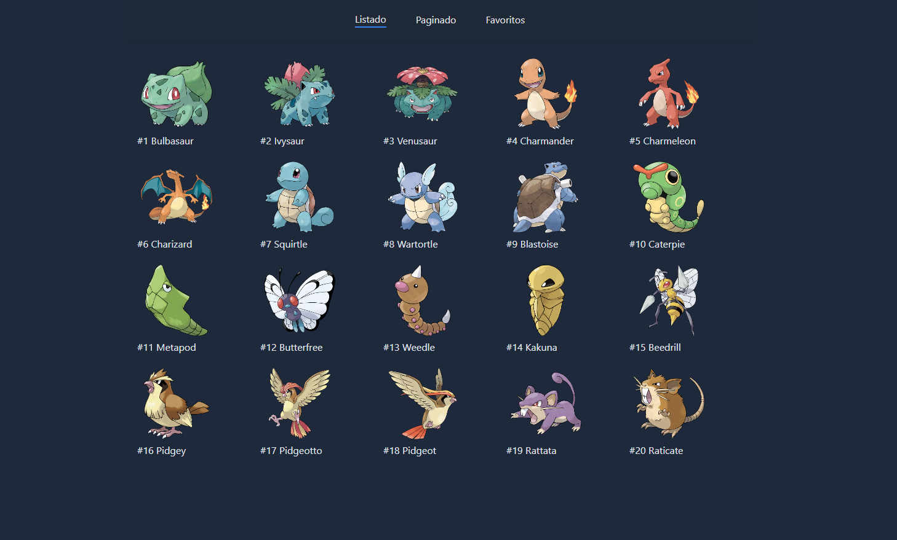

## 🚀 Getting Started

Astro project from `Fernando Herrera's` course, in this project we see topics related to pagination, static elements, view transitions, menus, responsive as well as ways to manage data from an API

## Project Structure

Inside of your Astro project, you'll see the following folders and files:

```text
/
├── public/
├── src/
│   └── pages/
│       └── index.astro
|       └── [name].astro
├── env.d.ts
├── tsconfig.json
├── vite.config.ts
├── astro.config.mjs
├── tailwind.config.mjs
├── package-lock.json
└── package.json
```

## 🧞 Commands

All commands are run from the root of the project, from a terminal:

| Command                   | Action                                           |
| :------------------------ | :----------------------------------------------- |
| `npm install`             | Installs dependencies                            |
| `npm run dev`             | Starts local dev server at `localhost:4321`      |
| `npm run build`           | Build your production site to `./dist/`          |
| `npm run preview`         | Preview your build locally, before deploying     |
| `npm run astro ...`       | Run CLI commands like `astro add`, `astro check` |
| `npm run astro -- --help` | Get help using the Astro CLI                     |


## Demonstrations


